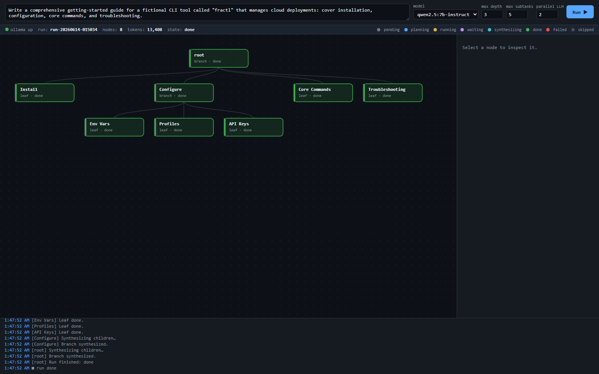

# harness-one — a fractal task-decomposition harness

A minimal, dependency-free Python harness that lets a local LLM tackle tasks far
larger than its context window, by treating the context window as **RAM** (loaded
and flushed deliberately) and keeping the real state on disk.



*The web visualizer: each node is a subtask coloured by state (planning → running
→ synthesizing → done), solid edges are parent→child, dashed edges are real
dependencies, and the live event log streams below.*

One recursive `Node` type is used identically at every level:

```
run_node(task):
    plan = decide(task)          # one LLM call
    if plan is atomic:           # LEAF
        return do(task)          # produce the deliverable + a compact summary
    else:                        # BRANCH
        children = plan.subtasks # wired as a DAG (edge = ordering, none = parallel)
        run children (parallel where no edge, respecting dependencies)
        return synthesize(children)   # assemble full child outputs -> result
```

Because the interface is identical, a branch orchestrating its children runs the
**same code** as the root orchestrating the whole job. It's self-similar all the
way down — fractal.

## Why it works (the design in one breath)

- **Externalized state.** The on-disk run directory (`runs/<id>/`) is the source
  of truth, not the message history. Nodes hold a compact summary + a pointer to
  their full artifact on disk.
- **DAG, not a list.** Children declare `depends_on`. Independent children run
  concurrently; dependents wait. Sequential vs parallel is just "is there an
  edge?". A topological, event-driven scheduler walks it.
- **Compaction over overflow.** Anything that aggregates content (synthesis,
  dependency context) is checked against the window *before* the call. If it
  would overflow, it is folded (map-reduce summarize) and oversized pieces are
  recursively summarized — never blindly truncated.
- **Retrieval over compression.** Synthesis pulls children's *full* outputs from
  the store to assemble the real deliverable; the compact summary is only what
  bubbles up to the grandparent.
- **Graceful degradation.** Decomposability gate (don't split what's atomic),
  depth cap, dependency-cycle breaking, partial-failure tolerance (a branch
  synthesizes from whatever subtasks succeeded), and planning-failure fallback
  (degrade to a direct attempt).

The honest limit (see it fail *loudly*, not silently): this is divide-and-conquer
for cognition. It extracts all the modularity a task *has*; it cannot create
modularity that isn't there. Densely-coupled tasks don't factor, and summaries
of them are lossy — that wall is a property of the task, not the harness.

## Requirements

- Python 3.9+ (tested on 3.14). **No pip packages** — stdlib only.
- [Ollama](https://ollama.com) running locally with a model pulled:
  ```
  ollama pull qwen2.5:7b-instruct      # fast, good default
  ollama pull qwen2.5:14b-instruct     # cleaner decomposition, slower
  ```
  `qwen2.5` is used because it is reliable at structured (JSON) output and
  distinguishing real data-dependencies from mere temporal order.

## Use it

CLI:

```
python run.py "your big task here"
python run.py "..." --max-depth 3 --max-subtasks 8 --concurrency 4 --verbose
python run.py "..." --model qwen2.5:14b-instruct --num-ctx 8192
python run.py --resume run-20260614-020133        # resume an existing run
python report.py                                   # scorecard for the last run
```

Web UI (live visualizer):

```
python serve.py        # open http://localhost:8765
```

Type a task, pick a model and limits, hit **Run**, and watch the tree build live:
nodes change colour through `planning → running/waiting → synthesizing → done`,
solid edges are parent→child, dashed purple edges are real dependencies, and
clicking a node shows its task, planner reasoning, summary, full output and
tokens. The bottom pane streams the live event log over Server-Sent Events.

## Layout

```
harness/
  llm.py        Ollama HTTP client (urllib), token accounting, JSON-mode + retries
  store.py      on-disk state store (source of truth), atomic writes, snapshots
  context.py    token estimation + budget packing for compaction
  prompts.py    planner / worker / synthesizer / compactor prompts + schemas
  harness.py    the recursive node: plan, leaf, branch, DAG scheduler, compaction
  events.py     thread-safe pub/sub for the live UI
run.py          CLI entry point
serve.py        web UI server (stdlib http.server + SSE)
report.py       per-run quality scorecard
web/index.html  single-file visualizer (vanilla JS + SVG)
runs/           per-run artifacts (the on-disk task tree)
```

## Tuning notes

- `--max-subtasks` is the coverage knob: if a "comprehensive" task is missing
  areas, the planner proposed more subtasks than the cap and they were dropped
  (this is logged, not silent). Raise it.
- `--max-depth` bounds recursion; depth is otherwise emergent (the gate stops
  splitting once a subtask is atomic).
- `--concurrency` caps simultaneous LLM calls. On a single local GPU the model
  serializes anyway, so the speedup from parallel branches is modest locally but
  real against a hosted API.
